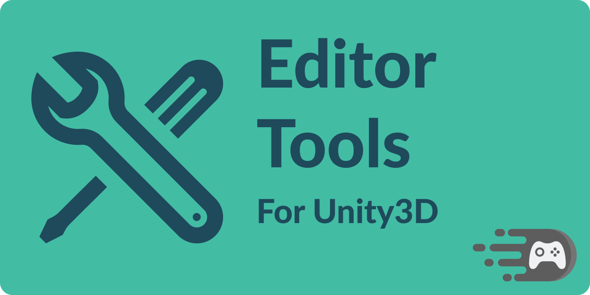

# editor-tools

Tools for improving the Unity Editor experience [View On GitHub](https://github.com/faster-games/editor-tools) ✨🏗




[](https://openupm.com/packages/com.faster-games.editor-tools/)
[](https://github.com/faster-games/editor-tools/actions/workflows/main.yml)
[](https://discord.gg/QfQE6rWQqq)

This package contains some useful editor tools that I found myself needing in several projects. For more details, see [the getting started docs](https://editor-tools.faster-games.com//manual/getting-started).

## Installing

This package supports [openupm](https://openupm.com/packages/com.faster-games.editor-tools/) - you can install it using the following command:

```
openupm add com.faster-games.editor-tools
```

Or by adding directly to your `manifest.json`:

> Note: You may also use specific versions by appending `#{version}` where version is a [Release tag](https://github.com/faster-games/editor-tools/releases) - e.g. `#v1.2.0`.

```
dependencies: {
	...
	"com.faster-games.ui-components": "git+https://github.com/faster-games/editor-tools.git"
}
```

Or by using [Package Manager](https://docs.unity3d.com/Manual/upm-ui-giturl.html) to "Add a package from Git URL", using the following url:

```
https://github.com/faster-games/editor-tools.git
```

## Supporting the project

If this project saved you some time, and you'd like to see it continue to be invested in, consider [buying me a coffee. ☕](https://www.buymeacoffee.com/bengreenier) I do this full-time, and every little bit helps! 💙
